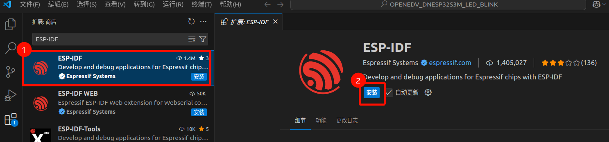
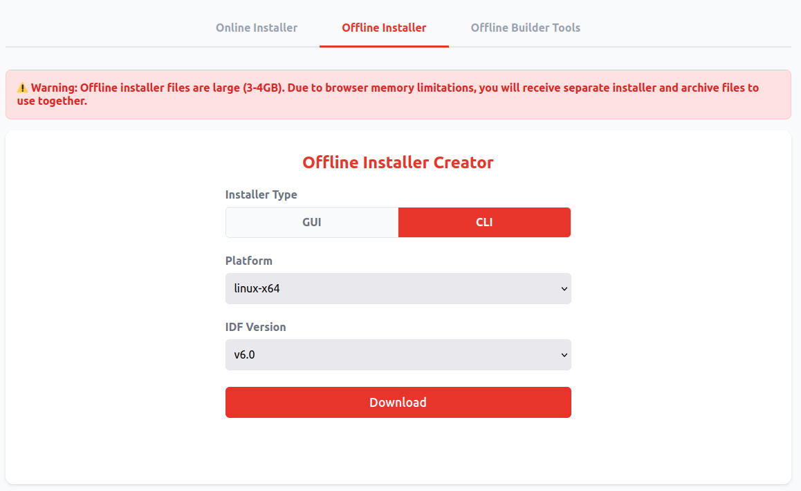
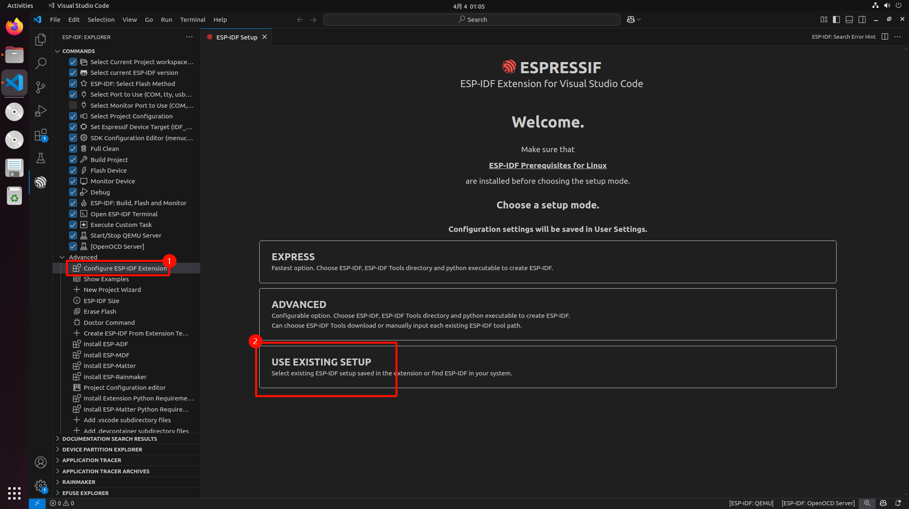
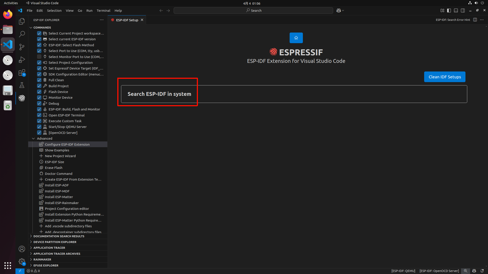
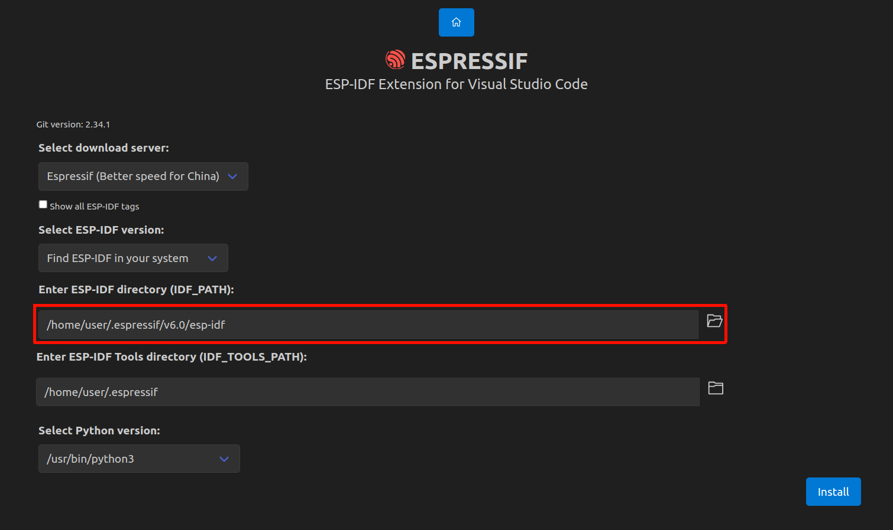
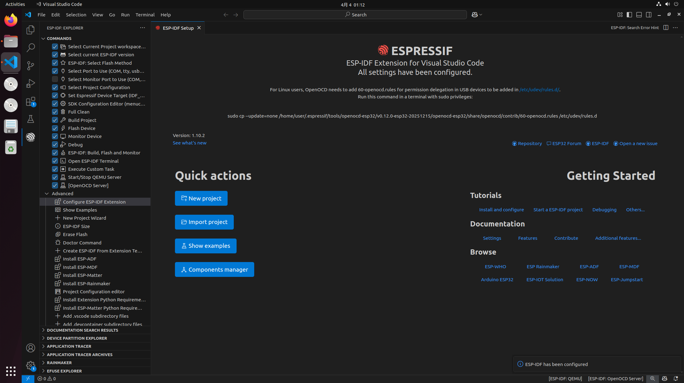
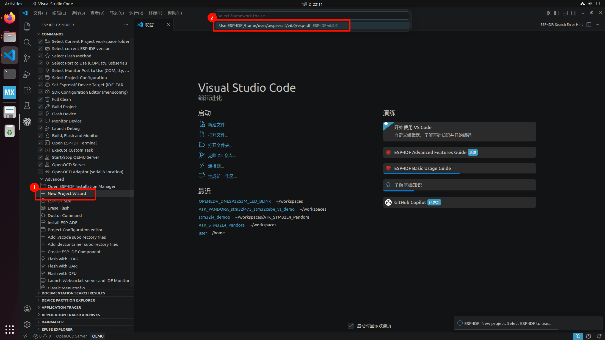
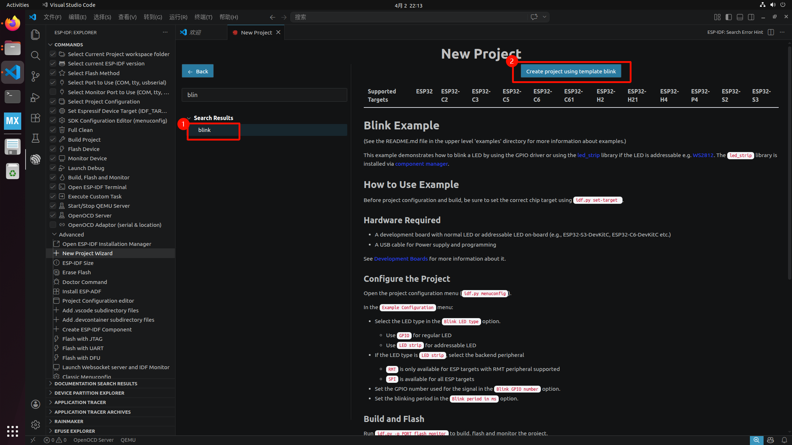
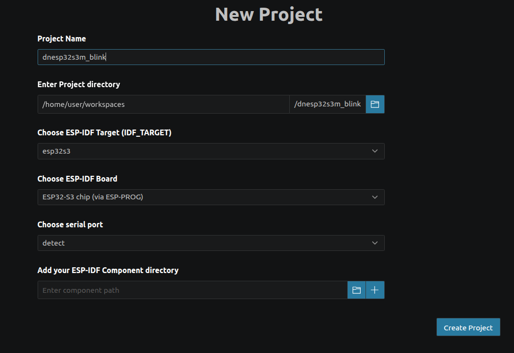
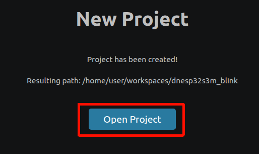

# 2026年 ESP-IDF 环境配置

## 环境

vscode 版本：1.114.0

esp-idf：6.0

esp-idf vscode 插件：1.10.2

OS：Ubuntu 22.04

## 安装 VSCode 插件

VSC 插件栏上搜索 ESP-IDF




安装 EIM (ESP-IDF Installation Manager)，该工具是26年乐鑫新退出的环境一站式安装工具

[在 Linux 上安装 ESP-IDF 及工具链 - ESP32 - &mdash; ESP-IDF 编程指南 latest 文档](https://docs.espressif.com/projects/esp-idf/zh_CN/latest/esp32/get-started/linux-setup.html)

[ESP-IDF Installation Manager Downloads](https://dl.espressif.cn/dl/eim/?tab=offline)

这里我们选择需要的IDF版本并下载 Offline 版的 EIM，Offline 安装会将所有相关环境工具都下载下来，但是考虑到国内网络环境，这样安装是最省心的。




下载后进行安装

```bash
sudo dpkg -i eim-cli-linux-x64.deb
```

安装python环境

```bash
sudo apt install python3-pip python3-venv -y
```

开始安装环境

```bash
eim install --use-local-archive archive_vv6.0_linux-x64.zst
```


等待完成安装，最终看到如下信息，安装成功

```bash
...
Configuration saved successfully to config.toml
2026-04-02 22:07:26 - 10 - 04 - INFO - Found git: /usr/bin/git
You have successfully installed ESP-IDF
for using the ESP-IDF tools inside the terminal, you will find activation scripts inside the base install folder
sourcing the activation script will setup environment in the current terminal session
============================================
to activate the environment, run the following command in your terminal:
       source "/home/user/.espressif/tools/activate_idf_v6.0.sh"
============================================
2026-04-02 22:07:27 - 10 - 04 - INFO - Wizard result: Ok
2026-04-02 22:07:27 - 10 - 04 - INFO - Successfully installed IDF
2026-04-02 22:07:27 - 10 - 04 - INFO - Now you can start using IDF tools
```

现在对 idf vscode 插件进行配置









这样就表示安装完成了




此时打开VSCode，进入IDF插件页，可以创建一个新的工程



搜索一下blink工程（LED闪烁），并点击创建



根据需求填写






## 常见问题

如果在烧录程序时出现

```bash
([Errno 13] could not open port /dev/ttyACM0: [Errno 13] Permission denied: '/dev/ttyACM0')

Hint: Try to add user into dialout or uucp group.
```

这一般是串口没有权限，需要设置关于esp设备usb的udev配置

[openocd-esp32/contrib/60-openocd.rules at master · espressif/openocd-esp32](https://github.com/espressif/openocd-esp32/blob/master/contrib/60-openocd.rules)

将上述文件下载或者创建并放入 /etc/udev/rules.d/60-openocd.rules 里

输入下面命令使其立即生效

```bash
sudo udevadm control --reload-rules
```

还需要将用户加入 dialout 组

```bash
sudo usermod -aG dialout $USER
```

改完上面，切记**一定要重新登录/重启才会生效**


