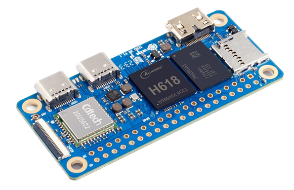
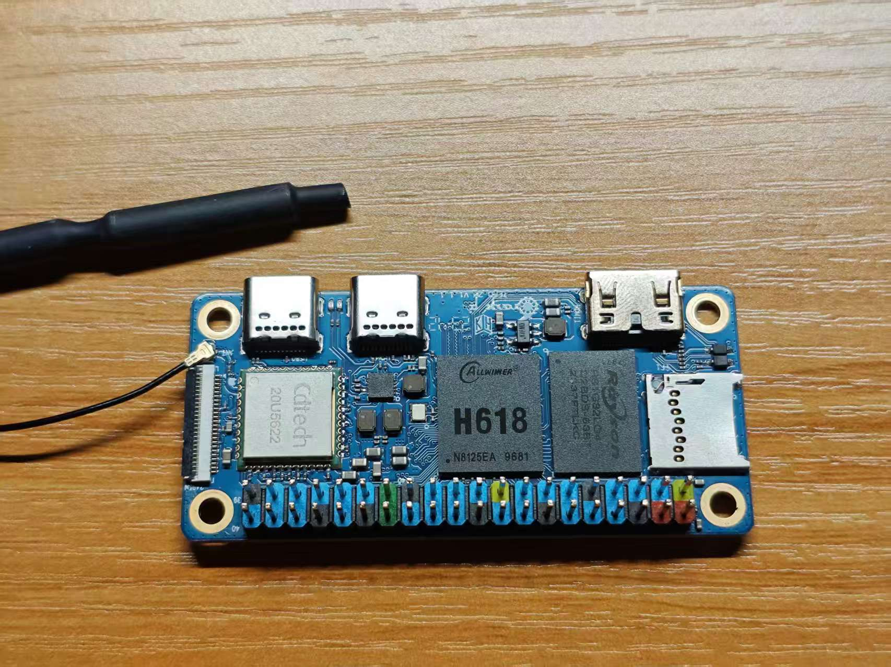
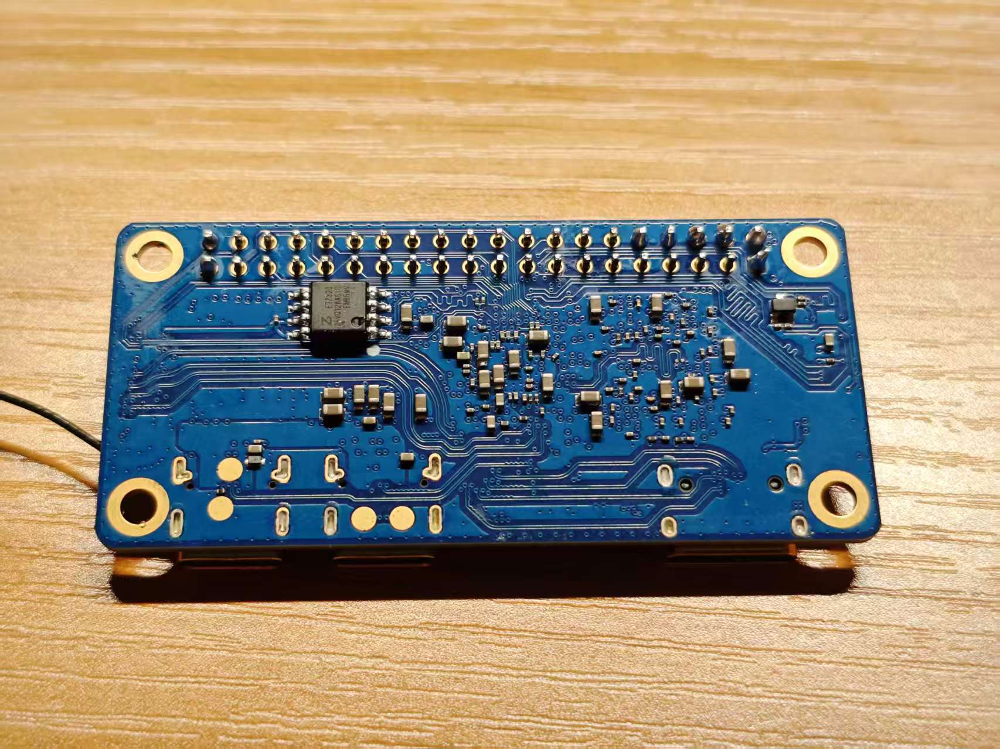
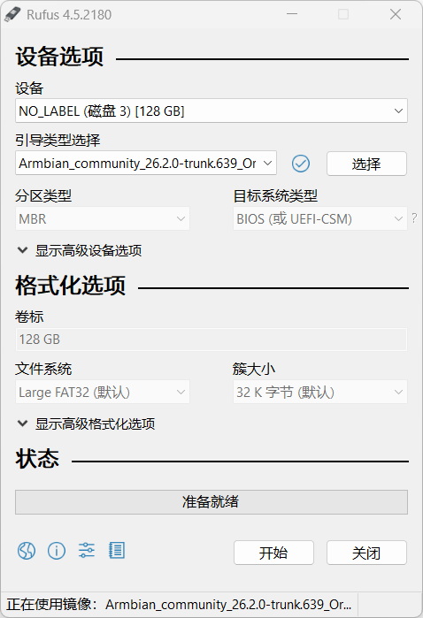
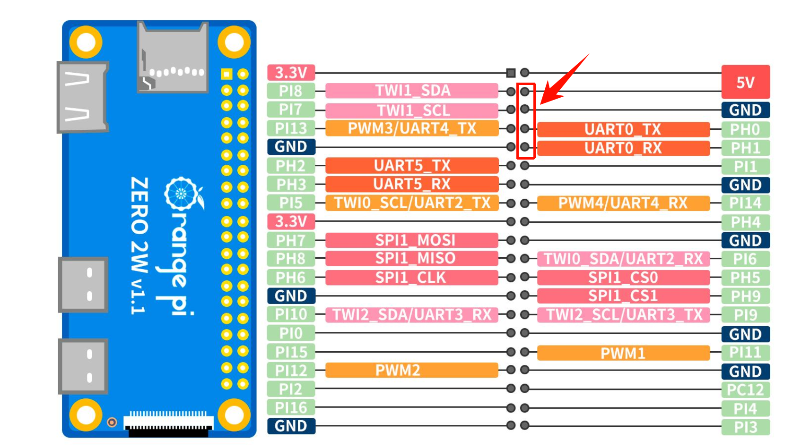
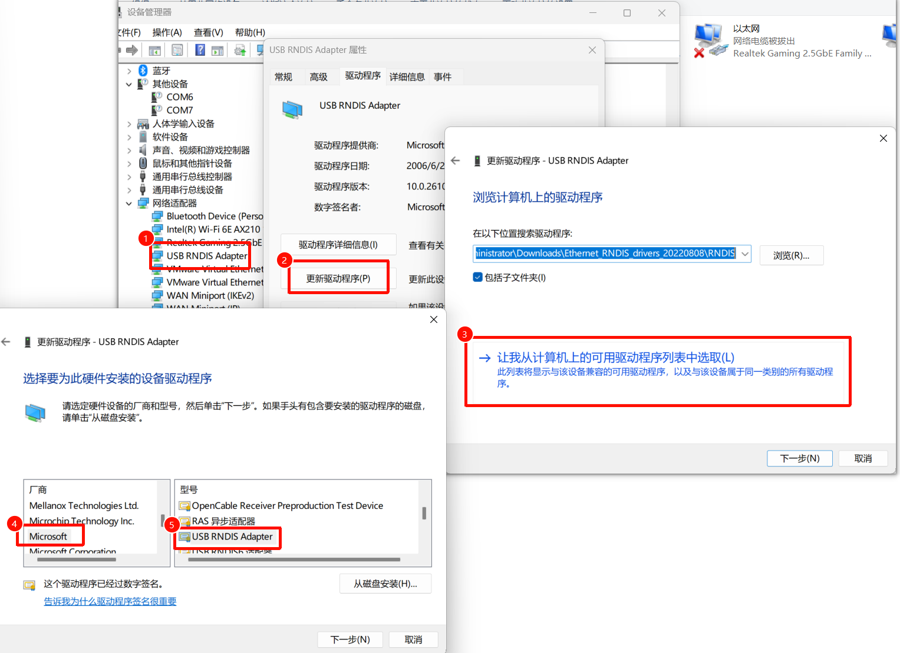

---

title: 折腾香橙派 Zero 2w
date: 2026-03-30
description: 折腾香橙派 Zero 2w
author: 深韩

---

# 折腾香橙派 Zero 2w

## 环境

**硬件**

1. 香橙派 Zero 2w (OrangePi Zero 2w)
2. USB转串口TTL
3. 128G TF卡 (官方要求8G以上)

**软件**

1. PC (Windows 11)
2. MobaXterm (用于连接串口，其他的也可以)
3. armbian系统镜像 ([Armbian_community_26.2.0-trunk.639_Orangepizero2w_noble_current_6.18.20_xfce_desktop.img.xz](https://www.armbian.com/orange-pi-zero-2w/))
   
   

## 开发板情况

板子是从海鲜市场上购买的，Zero2W，4G内存，板载16M Flash（默认烧录一个精简 Linux 用于测试板子）


从官网上的截图 

官网介绍连接：[Orange Pi Zero 2W](http://www.orangepi.cn/html/hardWare/computerAndMicrocontrollers/service-and-support/Orange-Pi-Zero-2W.html)




拿到的板子实物图（正面）




拿到的板子实物图（反面）



## 固件下载与烧录

官方提供了 [Orange Pi OS (Arch)](http://www.orangepi.cn/html/hardWare/computerAndMicrocontrollers/service-and-support/Orange-Pi-Zero-2W.html) 系统，但我比较熟悉 debian 系列的系统，因此本次烧录固件使用 Armbian [Armbian_community_26.2.0-trunk.639_Orangepizero2w_noble_current_6.18.20_xfce_desktop.img.xz](https://www.armbian.com/orange-pi-zero-2w/)

按照官方教程推荐使用 balenaEtcher 进行烧录，但我习惯使用 rufus 进行系统镜像烧录，经测试也是能够正常烧录的


使用 rufus 版本 v4.5.2180




使用的 TF 卡为 三星的 128g 白卡


关于SD卡选择需要注意的地方：

1. 需要大于 8GB

2. 对于某些品牌的SD卡，根据官方文档说明，好像还存在兼容性问题


## 使用串口tty首次连接

由于我没有 mini HDMI 口转接器，因此采用板子的 UART0 进行首次连接与配置


首先使用 USB转串口连接板子下面几个接口



连接顺序：

USB转串口 5V -- 板子 5V

USB转串口 RX -- 板子 UART0_TX

USB转串口 TX -- 板子 UART0_RX

USB转串口 GND -- 板子 GND 


在完成系统镜像烧写后，就可以将卡插板子上，并上电启动

这里需要注意的是，在系统上电后，需要尽快打开串口，显示打印内容。因为 armbian 在首次启动时，会进入它的 root 用户密码配置流程，如果串口打开太晚，会导致串口上看不到任何提示信息。


上电后会立刻显示 boot 日志

```bash
Hit any key to stop autoboot:  0
switch to partitions #0, OK
mmc0 is current device
Scanning mmc 0:1...
Found U-Boot script /boot/boot.scr
4641 bytes read in 1 ms (4.4 MiB/s)
## Executing script at 4fc00000
U-boot loaded from SD
Boot script loaded from mmc
204 bytes read in 0 ms
Load fdt: /boot/dtb/allwinner/sun50i-h618-orangepi-zero2w.dtb
46416 bytes read in 5 ms (8.9 MiB/s)
Working FDT set to 4fa00000
4203 bytes read in 2 ms (2 MiB/s)
Applying kernel provided DT fixup script (sun50i-h616-fixup.scr)
## Executing script at 45000000
20685814 bytes read in 853 ms (23.1 MiB/s)
40016384 bytes read in 1648 ms (23.2 MiB/s)
Moving Image from 0x40080000 to 0x40200000, end=0x42910000
## Loading init Ramdisk from Legacy Image at 4ff00000 ...
   Image Name:   uInitrd
   Image Type:   AArch64 Linux RAMDisk Image (gzip compressed)
   Data Size:    20685750 Bytes = 19.7 MiB
   Load Address: 00000000
   Entry Point:  00000000
   Verifying Checksum ... OK
## Flattened Device Tree blob at 4fa00000
   Booting using the fdt blob at 0x4fa00000
Working FDT set to 4fa00000
   Loading Ramdisk to 48c45000, end 49fff3b6 ... OK
   Loading Device Tree to 0000000048bd1000, end 0000000048c44fff ... OK
Working FDT set to 48bd1000

Starting kernel ...


```


板子上电源指示灯（红色）旁边的数据指示灯（绿色）会开始闪烁，说明系统正确启动

<!--  -->

首次启动 armbian 会要求设置初始 root 密码，连接wifi，以及初始化一个普通用户

```bash
Welcome to Armbian_community!

Documentation: https://docs.armbian.com | Community support: https://community.armbian.com/

IP address:  Network connection timeout!

Create root password: ************
Repeat root password: ************

Developer Preview Build

This Armbian image was generated automatically for development and testing purpose.
It may include unfinished features or unstable components.

If you are not here to report issues or just test it, please do not use this image in production.
Expect things to change — or even break — as improvements are made.

Choose default system command shell:

1) bash
2) zsh
1

Shell: BASH

Creating a new user account. Press <Ctrl-C> to abort

Desktop environment will not be enabled if you abort the new user creation

Please provide a username (eg. your first name): user
Create user (user) password: ************
Repeat user (user) password: ************

Please provide your real name: User

Dear User, your account user has been created and is sudo enabled.
Please use this account for your daily work from now on.

Internet connection was not detected.

Connect via wireless? [Y/n] y

Detected wireless networks:

1        KKF
2        KKF_5G
3        midea
4        hahaha
5        hahaha-5G
6        ZTE
7        ZTE-5G

Enter a number of SSID: 6

Enter a password for ZTE: ******

Probing internet connection (8)

Detected timezone: Asia/Shanghai

Set user language based on your location? [Y/n]

At your location, more locales are possible:

1) bo_CN                    4) ug_CN@latin
2) ug_CN                    5) zh_CN.UTF-8
3) ug_CN@latin              6) Skip generating locales
Please enter your choice:5

Generating locales: zh_CN.UTF-8

Now starting desktop environment...


Armbian_community 26.2.0-trunk.639 Noble ttyS0

orangepizero2w login:
```


## 进行一些基础配置

### 更新 apt

```bash
sudo apt update
```

### 安装常用软件

```bash
sudo apt install vim net-tools btop firefox -y
```

### 使用SSH连接

完成首次上电配置后，连接上WIFI，就可以使用SSH进行连接（SSH默认自启）

```bash
    _             _    _                                         _ _
   /_\  _ _ _ __ | |__(_)__ _ _ _    __ ___ _ __  _ __ _  _ _ _ (_) |_ _  _
  / _ \| '_| '  \| '_ \ / _` | ' \  / _/ _ \ '  \| '  \ || | ' \| |  _| || |
 /_/ \_\_| |_|_|_|_.__/_\__,_|_||_|_\__\___/_|_|_|_|_|_\_,_|_||_|_|\__|\_, |
                                 |___|                                 |__/
 v26.2 rolling for Orange Pi Zero2W running Armbian Linux 6.18.20-current-sunxi64

 Packages:     Ubuntu stable (noble)
 Updates:      Kernel upgrade enabled and 1 package available for upgrade
 Support:      for advanced users (rolling release)
 IPv4:         (LAN) 192.168.110.42

 Performance:

 Load:         2%                Uptime:         38m
 Memory usage: 8% of 3.83G
 CPU temp:     47°C              Usage of /:   4% of 117G
 RX today:     405 MiB

 Commands:

 Configuration: armbian-config
 Upgrade      : armbian-upgrade
 Monitoring   : htop

user@orangepizero2w:~$


```


### 安装 vnc 验证桌面环境

> NoMachine 与 VNC 二选一安装即可，效果相同

主要参考文章

> [在 armbian 上安装 xfce 和 VNC 做远程桌面 | 泠泫凝的异次元空间](https://lxnchan.cn/vnc-and-desktop-on-armbian.html)


由于不使用 HDMI 接口，这里安装 tigervnc 验证桌面环境

安装xfce和vnc

```bash
apt update
apt install xrdp -y
apt install dbus-x11 -y
```

安装好之后`reboot`一下

```bash
sudo apt install tigervnc-standalone-server tigervnc-tools -y
```

配置 vnc 账户密码

```bash
user@orangepizero2w:~$ vncserver

You will require a password to access your desktops.

Password:
Verify:
Would you like to enter a view-only password (y/n)? n
A view-only password is not used

New Xtigervnc server 'orangepizero2w:1 (user)' on port 5901 for display :1.
Use xtigervncviewer -SecurityTypes VncAuth -passwd /tmp/tigervnc.kNX2i4/passwd :1 to connect to the VNC server.

user@orangepizero2w:~$
```

输入两次密码然后会询问你是否创建仅观看（View-only）的密码，输入仅观看密码登录到VNC的用户只能观看远程桌面不能进行控制，可以创建也可以直接输入“n”跳过。
设置好后杀掉创建出来的VNC进程：

```bash
vncserver -kill :1
```

```bash
nano ~/.vnc/xstartup
```

键入如下内容：

```shell
#!/bin/bash
startxfce4
```

给这个文件加运行权限：

```bash
chmod +x ~/.vnc/xstartup
```

测试是否可用：

```bash
vncserver -localhost no
```

`-localhost no`为可远程连接，此时可以在另一台设备上用vnc连一下试试。  测试好了直接kill掉就行：

```bash
vncserver -kill :1
```

设置VNC开机启动

```shell
# nano /etc/systemd/system/vncserver@.service
[Unit]
Description=Start TightVNC server at startup
After=syslog.target network.target

# 请务必将 User、Group、WorkingDirectory 的值以及 PIDFILE 值更改为匹配您的用户名
[Service]
Type=simple
User=user
Group=user
WorkingDirectory=/home/user

PIDFile=/home/user/.vnc/%H:590%i.pid
ExecStartPre=-/usr/bin/vncserver -kill :%i
# -depth 指定色深度，可选值16、24、32；-geometry 指定分辨率。
# 修改后需要指定 systemctl daemon-reload 重载配置文件
ExecStart=/usr/bin/vncserver -depth 24 -geometry 1280x720 :%i -localhost no
ExecStop=/usr/bin/vncserver -kill :%i

[Install]
WantedBy=multi-user.target
```

设置开机启动：

```bash
sudo systemctl daemon-reload
sudo systemctl start vncserver@1
sudo systemctl enable vncserver@1
```


### 安装 NoMachine 验证桌面环境

> NoMachine 与 VNC 二选一安装即可，效果相同

下载 arm 版本 nomachine，下载地址：[https://download.nomachine.com/download/?id=30&platform=linux&distro=arm](https://download.nomachine.com/download/?id=30&platform=linux&distro=arm)

安装

```bash
sudo dpkg -i nomachine_9.4.14_1_arm64.deb
```

### 安装 Nodejs

先下 arm64 版本的 Node [https://nodejs.org/zh-cn/download](https://nodejs.org/zh-cn/download)

手动创建安装目录

```bash
cd /usr/local
sudo mkdir nodejs
cd nodejs
```

将 Nodejs 下载到该文件夹里，并解压

```bash
sudo wget http://nodejs.org/dist/v24.14.1/node-v24.14.1-linux-arm64.tar.xz
tar xvf node-v24.14.1-linux-arm64.tar.xz
```

创建链接

```bash
sudo ln -s /usr/local/nodejs/node-v24.14.1-linux-arm64/bin/node /usr/local/bin
sudo ln -s /usr/local/nodejs/node-v24.14.1-linux-arm64/bin/npm /usr/local/bin
sudo ln -s /usr/local/nodejs/node-v24.14.1-linux-arm64/bin/npx /usr/local/bin
```

修改源

```bash
npm config set registry https://registry.npmmirror.com
```

## 配置 USB gadget 虚拟网卡 (RNDIS) 与虚拟串口

写入启动脚本 /usr/local/bin/usb-gadget.sh

```bash
#!/bin/bash
# /usr/local/bin/usb-gadget.sh
# USB Gadget 配置脚本
# 用于 Orange Pi Zero 2W 调试

GADGET_NAME="opi_gadget"
USB_IP="192.168.137.2"
USB_NETMASK="255.255.255.0"
USB_GATEWAY="192.168.137.1"
# 加载必要模块
modprobe libcomposite 2>/dev/null || { echo "无法加载 libcomposite 模块"; exit 1; }

# 挂载 configfs（如果未挂载）
if [ ! -d /sys/kernel/config/usb_gadget ]; then
    mount -t configfs none /sys/kernel/config 2>/dev/null || { echo "无法挂载 configfs"; exit 1; }
fi

# 进入 Gadget 配置目录
cd /sys/kernel/config/usb_gadget/ 2>/dev/null || { echo "configfs 不可用"; exit 1; }

# 如果已存在则先删除旧配置
if [ -d "$GADGET_NAME" ]; then
    echo "删除旧配置..."
    # 先断开 UDC
    if [ -s "$GADGET_NAME/UDC" ]; then
        echo "" > "$GADGET_NAME/UDC" 2>/dev/null
        sleep 0.5
    fi
    # 删除符号链接
    find "$GADGET_NAME/configs" -type l -delete 2>/dev/null
    # 删除功能目录
    rm -rf "$GADGET_NAME/functions/"* 2>/dev/null
    rm -rf "$GADGET_NAME/configs/"* 2>/dev/null
    rm -rf "$GADGET_NAME/strings/"* 2>/dev/null
    rm -rf "$GADGET_NAME"
fi

# 创建 Gadget 设备
mkdir -p "$GADGET_NAME"
cd "$GADGET_NAME"

# 设置设备信息
echo 0x1d6b > idVendor      # Linux Foundation
echo 0x0104 > idProduct     # Multifunction Composite Gadget
echo 0x0100 > bcdDevice      # v1.0.0
echo 0x0200 > bcdUSB         # USB 2.0

# 设置设备描述字符串
mkdir -p strings/0x409
echo "$(cat /proc/sys/kernel/hostname)-$(date +%s)" > strings/0x409/serialnumber
echo "Orange Pi" > strings/0x409/manufacturer
echo "Orange Pi Zero 2W USB Ethernet" > strings/0x409/product

# 创建配置
mkdir -p configs/c.1/strings/0x409
echo "RNDIS + Serial" > configs/c.1/strings/0x409/configuration
echo 250 > configs/c.1/MaxPower

# 创建 RNDIS 以太网功能（Windows兼容性好）
mkdir -p functions/rndis.usb0
# 设置 MAC 地址
echo "02:00:00:00:00:02" > functions/rndis.usb0/host_addr
echo "02:00:00:00:00:01" > functions/rndis.usb0/dev_addr

# 创建 ACM 串口功能
mkdir -p functions/acm.usb0

# Windows 需要 OS 描述符支持
echo 1 > os_desc/use
echo 0xcd > os_desc/b_vendor_code
echo MSFT100 > os_desc/qw_sign

# 将功能链接到配置
ln -s functions/rndis.usb0 configs/c.1/
ln -s functions/acm.usb0 configs/c.1/
ln -s configs/c.1 os_desc

# 获取 USB 控制器并激活
UDC=$(ls /sys/class/udc/ | head -n1)
if [ -z "$UDC" ]; then
    echo "错误: 未找到 USB Device Controller"
    exit 1
fi

echo "启用 UDC: $UDC"
echo "$UDC" > UDC

# 等待接口出现
for i in {1..10}; do
    if ip link show usb0 >/dev/null 2>&1; then
        break
    fi
    sleep 0.5
done

# 配置网络接口
if ip link show usb0 >/dev/null 2>&1; then
    ip addr flush dev usb0 2>/dev/null
    ip addr add "$USB_IP/$USB_NETMASK" dev usb0
    ip link set usb0 up
        # 添加默认网关
    ip route add default via "$USB_GATEWAY" dev usb0 2>/dev/null && echo "默认网关已配置: $USB_GATEWAY" || echo "警告: 默认网关配置失败"
    # 配置 DNS 服务器
    echo "nameserver 223.5.5.5" > /etc/resolv.conf
    echo "nameserver 8.8.8.8" >> /etc/resolv.conf
    echo "DNS 已配置: 223.5.5.5, 8.8.8.8"
    echo "USB Gadget 网口已配置: $USB_IP/24"
else
    echo "警告: usb0 接口未出现"
    exit 1
fi

# 启动 USB 串口登录服务
for i in {1..10}; do
    if [ -c /dev/ttyGS0 ]; then
        systemctl start serial-getty@ttyGS0.service 2>/dev/null && echo "USB 串口 ttyGS0 登录服务已启动" || echo "USB 串口登录服务启动失败"
        break
    fi
    sleep 0.5
done

echo "USB Gadget 模式已启动"
echo "设备IP: $USB_IP"
```

然后给予执行权限

```bash
sudo chmod +x /usr/local/bin/usb-gadget.sh
```

写入服务配置 /etc/systemd/system/usb-gadget.service

```bash
[Unit]
Description=USB Gadget Network (RNDIS)
After=systemd-modules-load.service
Before=network.target

[Service]
Type=oneshot
User=root
Group=root
RemainAfterExit=yes
ExecStart=/usr/local/bin/usb-gadget.sh
ExecStop=/bin/bash -c 'echo "" > /sys/kernel/config/usb_gadget/opi_gadget/UDC 2>/dev/null; ip link set usb0 down 2>/dev/null'
Restart=on-failure
RestartSec=2

[Install]
WantedBy=multi-user.target

```

重启 systemctl daemon

```bash
sudo systemctl daemon-reload
```

服务启动/停止控制

```bash
sudo systemctl start usb-gadget # 启动
sudo systemctl stop usb-gadget # 停止
sudo systemctl restart usb-gadget # 重启
```

服务启用自启动

```bash
sudo systemctl enable usb-gadget
```

### Windows 端网络共享配置

以上配置完成后，重启板子并连接 USB 接口，电脑设备管理器上会出现 RNDIS 网卡。

**1. 驱动安装**

如果驱动无法识别，按照下面方法更新驱动：

1. 设备管理器中找到未知设备（带黄色感叹号）
2. 右键 → 更新驱动程序 → 浏览我的计算机以查找驱动程序
3. 让我从计算机上的可用驱动程序列表中选取
4. 选择「网络适配器」→ 厂商「Microsoft」→ 型号「Remote NDIS Compatible Device」

**2. 配置静态 IP**

为 RNDIS 网卡配置静态 IP：

- IP 地址：`192.168.137.101`
- 子网掩码：`255.255.255.0`
- 默认网关：留空

**3. 启用网络共享**

1. 打开「网络连接」（`ncpa.cpl`）
2. 右键你的主网卡（Wi-Fi 或有线网卡）→ 属性 → 共享
3. 勾选「允许其他网络用户通过此计算机的 Internet 连接」
4. 下拉选择 RNDIS Gadget 网卡
5. 点击确定

> **注意**：启用共享后，Windows 会自动将 RNDIS 网卡的 IP 改为 `192.168.137.1`，这是正常现象。

**4. 防火墙设置**

如果无法 ping 通 Windows，请临时关闭防火墙测试：

- 或者添加允许 192.168.137.0/24 网段的入站规则

**5. 验证连接**

在 Orange Pi 上执行：

```bash
ping 192.168.137.1    # 测试与 Windows 连接
ping 223.5.5.5        # 测试外网连接
curl baidu.com        # 测试 DNS 解析
```




## 系统监控

### 查看系统温度

```bash
sensors

cpu_thermal-virtual-0
Adapter: Virtual device
temp1:        +48.1°C

gpu_thermal-virtual-0
Adapter: Virtual device
temp1:        +48.4°C

ddr_thermal-virtual-0
Adapter: Virtual device
temp1:        +48.7°C

ve_thermal-virtual-0
Adapter: Virtual device
temp1:        +47.4°C

```


### 40Pin GPIO引脚

安装 wiringOP

先clone源码

```bash
git clone https://github.com/orangepi-xunlong/wiringOP.git -b next
```

build

```bash
sudo ./build clean
sudo ./build
```

测试

```bash
gpio readall
```

此时应该会输出

```bash
 +------+-----+----------+--------+---+  ZERO2W  +---+--------+----------+-----+------+
 | GPIO | wPi |   Name   |  Mode  | V | Physical | V |  Mode  | Name     | wPi | GPIO |
 +------+-----+----------+--------+---+----++----+---+--------+----------+-----+------+
 |      |     |     3.3V |        |   |  1 || 2  |   |        | 5V       |     |      |
 |  264 |   0 |    SDA.1 |    OFF | 0 |  3 || 4  |   |        | 5V       |     |      |
 |  263 |   1 |    SCL.1 |    OFF | 0 |  5 || 6  |   |        | GND      |     |      |
 |  269 |   2 |     PWM3 |    OFF | 0 |  7 || 8  | 0 | ALT2   | TXD.0    | 3   | 224  |
 |      |     |      GND |        |   |  9 || 10 | 0 | ALT2   | RXD.0    | 4   | 225  |
 |  226 |   5 |    TXD.5 |    OFF | 0 | 11 || 12 | 0 | OFF    | PI01     | 6   | 257  |
 |  227 |   7 |    RXD.5 |    OFF | 0 | 13 || 14 |   |        | GND      |     |      |
 |  261 |   8 |    TXD.2 |    OFF | 0 | 15 || 16 | 0 | OFF    | PWM4     | 9   | 270  |
 |      |     |     3.3V |        |   | 17 || 18 | 0 | OFF    | PH04     | 10  | 228  |
 |  231 |  11 |   MOSI.1 |    OFF | 0 | 19 || 20 |   |        | GND      |     |      |
 |  232 |  12 |   MISO.1 |    OFF | 0 | 21 || 22 | 0 | OFF    | RXD.2    | 13  | 262  |
 |  230 |  14 |   SCLK.1 |    OFF | 0 | 23 || 24 | 0 | OFF    | CE.0     | 15  | 229  |
 |      |     |      GND |        |   | 25 || 26 | 0 | OFF    | CE.1     | 16  | 233  |
 |  266 |  17 |    SDA.2 |    OFF | 0 | 27 || 28 | 0 | OFF    | SCL.2    | 18  | 265  |
 |  256 |  19 |     PI00 |    OFF | 0 | 29 || 30 |   |        | GND      |     |      |
 |  271 |  20 |     PI15 |    OFF | 0 | 31 || 32 | 0 | OFF    | PWM1     | 21  | 267  |
 |  268 |  22 |     PI12 |    OFF | 0 | 33 || 34 |   |        | GND      |     |      |
 |  258 |  23 |     PI02 |    OFF | 0 | 35 || 36 | 0 | OFF    | PC12     | 24  | 76   |
 |  272 |  25 |     PI16 |    OFF | 0 | 37 || 38 | 0 | OFF    | PI04     | 26  | 260  |
 |      |     |      GND |        |   | 39 || 40 | 0 | OFF    | PI03     | 27  | 259  |
 +------+-----+----------+--------+---+----++----+---+--------+----------+-----+------+
 | GPIO | wPi |   Name   |  Mode  | V | Physical | V |  Mode  | Name     | wPi | GPIO |
 +------+-----+----------+--------+---+  ZERO2W  +---+--------+----------+-----+------+
```


待续未完...
