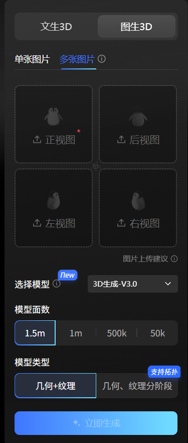
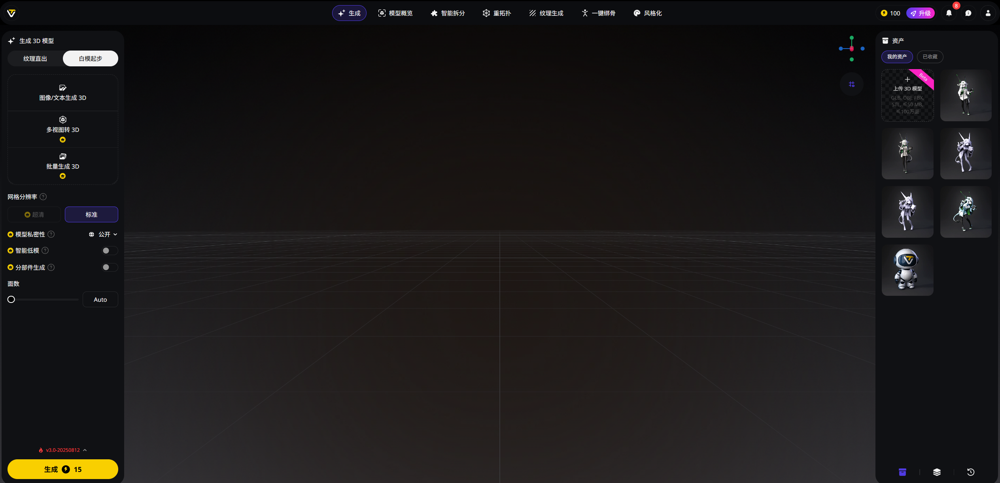
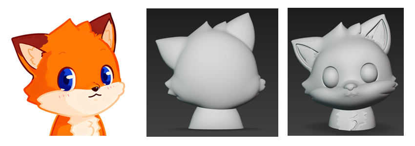
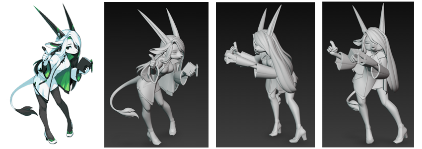
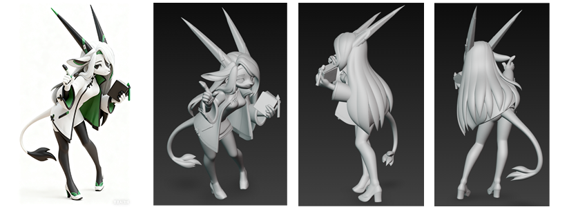

# 通过AI进行角色的3D模型生成

最近看到使用AI来生成3D模型很火，便想尝试一下。本文记录了我如何使用现有的免费的AI完成从最原始的2D参考图像到最终得到一个效果还不错的3D模型的过程。

## 3D模型生成AI的选择

这一步是最重要、最主要的一步，也是我最先开始考虑的部分。我在B站上大致调查了一下，目前做2D图转3D模型效果比较好且免费使用的主要就两个：一个是腾讯混元3D，另一个是Tripo。

### 腾讯混元3D

他首先免费使用，每天限制次数20次。并且是目前为止我所看到的能免费进行多参考图（多视角）进行3D模型生成的AI

### Tripo Studio

提供基础功能免费使用，每天100点数，默认情况生成一次点数消耗15。如果要使用多参考图生成模型，需要开通会员

**总结：** 在多次尝试单参考图进行模型生成后，对比两家的效果，我还是认为**腾讯的模型更胜一筹**。对比于腾讯的模型，Tripo目前会存在一种现象，就是生成出来的模型从正面看过去都很正常，但某些模型一旦转到另一个角度（比如侧面）就会出现“被压扁”的现象，并且这种现象很常见。

对于腾讯混元模型，有一点不足的地方就是，如果之给提供角色的正视角参考图进行生成，很多时候对于角色背面的细节很难还原到位（单张图想象力不够，不过这一点可以通过多参考图来弥补，后面会说到）

不过在大多数情况下，Tripo 生成出来的模型细节完善程度还是要高于腾讯混元的

## 尝试单参考图（单角度）直接进行 3D 模型生成

最一开始我先使用我的头像图片进行尝试，使用腾讯混元3D，V3.0版本，面数1.5M，生成的效果如上图所示。最左侧的是原图，右边两个是两次生成的结果，第一次生成仅对角色的轮廓进行了生成。第二次好了一些，能够对角色面部细节正确生成，但还是有较大瑕疵。

如果此时我们换一个视角进行观察，比如切换到侧视角，就会发现一个更严重的问题，模型完全被“压缩了”，如上图所示

我感觉可能是我提供的参考图太过于简陋，缺失完整的躯干与四肢结构，如果我们换另一个角色再进行尝试会如何呢？这里我们使用现成角色 [“理碧” (by 钛山 Tyson Tan)](https://tai3.cn/wiki/spirit-animals-wiki/libbie-said/) 再进行尝试。
经过多次生成后，发现仍存在类似的问题：正面视角观察感觉没太大的问题，一旦转动视角就“露馅”了

## 对参考图进行优化

**思路**

上述尝试我故意使用了两个2D动画风格极强、人体结构不是特别完整的角色插图作为参考图，这在很大程度上会导致AI读不出图像里的”深度“信息，导致生成的模型只有在特定角度下查看才“正确”，而一旦改变视角，模型就会出现“拉伸”、“压扁”的问题，其二，由于该类型的参考图都是人工手绘完成，难免能在透视上做到100%的准确，因此也会造成模型“崩坏”。

解决上述的问题，我首先想到的一个思路就是利用多模态大语言AI模型对原始参考图进行优化：

1. 修正原参考图因手工作画导致的透视不准确的问题
2. 给原参考图加上更好的深度信息

**实践**

目前国内免费、效果较好且具有文生图能力的大语言模型有很多，这里选择[豆包](https://www.doubao.com)作为例子

传入参考图，并输入以下提示词，生成结果如图所示。
> 将其转换为3D手办风格，背景白色，配色需保持一致

在将其作为新的参考图，传入混元模型进行生成，得到的效果如图所示。肉眼可见效果比之前好了很多，首先角色在各角度上观察是一致的，角色模型的比例也正常。

但是，这还存在一些不足：首先，我是经过了多次生成尝试才得到上述较为满意的结果，并不能一次生成就能得出最好的。其次，在上面的第四张图上（背面视角）可以看出细节相对于正面视角严重不足。这应该是缺少背面参考信息，还有生成的角色模型缺失左耳等问题，因此还可以进一步优化。

